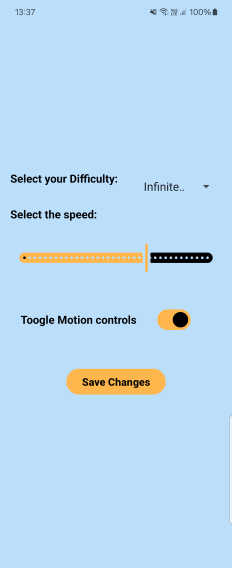
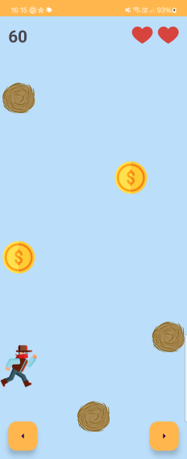
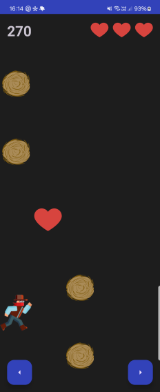
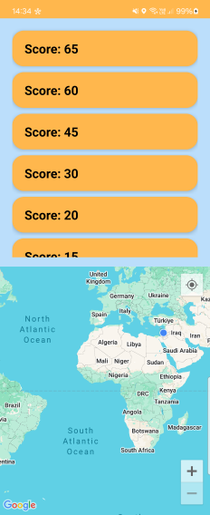
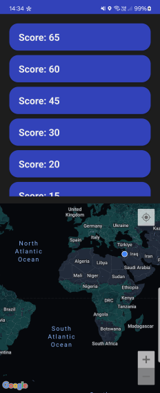

# Sheriff Dodge

A Game made as part of HW at Afeka's `Mobile Apps - 25A10357` Class.

## How to Run

> To use this app, you need a valid Maps API token. Make sure to save the token safely with Gradle Secrets.

- Save your `token` in the project directory under `secrets.properties`:
  ```properties
  MAPS_API_KEY=<Your Token>
  ```

# Overview

Sheriff Dodge is a game built using `Kotlin 2.1.0`, designed for Android devices.

## App Flow


### 1. Main Menu


|  |  |
| ---------------------------------- | --------------------------------------- |

- **Start Game** - Starts the `game loop`, with the setting selected by the user.
- **Settings** - shows the settings screen.
- **Scoreboard** - shows the scoreboard screen.
- **Exit** - closes the app

### 2. Settings


|  |  |
| ---------------------------------------------- | --------------------------------------------------- |

The settings screen uses the `SettingsManager` to define `global settings` that every other class uses.

`moving objects` - coins, hearts and obstacles
`TiltDetector` - Uses the device's `accelerometer` to identify tilt.

- **Difficulty** - each difficulty settings changes the amount of `moving objects` in each row. Defaults to `Infinitely Easy` which is the easiest difficulty
- **Speed** - changes the tick speed (delay) of the game, Effecting `moving objects`. Defaults to `500`
- **Motion controls** - toggles the motion game controls. Uses `TiltDetector`. Defaults to `off`

### 3. Game


|  |  |
| ------------------------ | ----------------------------- |

Game Loop - uses `kotlin-coroutines` with the `delay` defined in `SettingsManager` to create a tick speed for the `moving objects`
`TiltDetector` - Uses the device's `accelerometer` to identify tilt.

- **Motion controls** - using `TiltDetector` creates a callback to move the player base on device tilt (to the sides)
- **Speed offset** - when using `motion controls`, if the device is tilted up/down, the speed increases/decreases accordingly.
- **Background music** - plays a `western theme` using android's `MediaPlayer`.
- **On obstacle hit** - displays a `Toast Massage` and plays an `8-bit Gunshot` sound.

### 4. Scoreboard


|  |  |
| -------------------------------------------------- | ------------------------------------------------------- |

ScoreManager - save the scores in the app `Shared Preference` and loads them into a list using [prefy](https://github.com/paz-lavi/Prefy.git)

Display the `top 10` scores achieved.

- **On Score Click** - The map zooms in to where you achieved the score.
- **Add score** Adds the score to `ScoreManager` with `FusedLocationProvider` based on current location.
- **Location perms** - uses [EasyPermissions](https://github.com/VMadalin/easypermissions-ktx) to handle `location permissions`
- **Maps Platform API** - uses `SupportMap` to display the map, and saves the `API token` token safely with `Gradle Secrets`

## Authors

- [@lordYorden](https://github.com/lordYorden)
