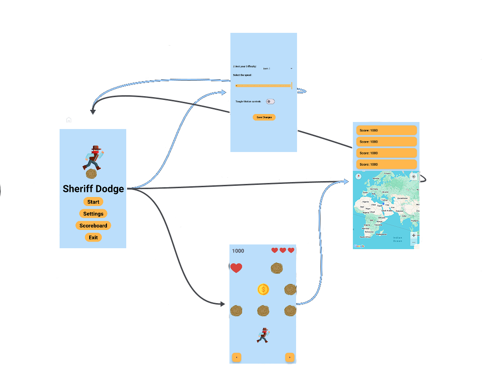
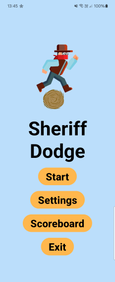
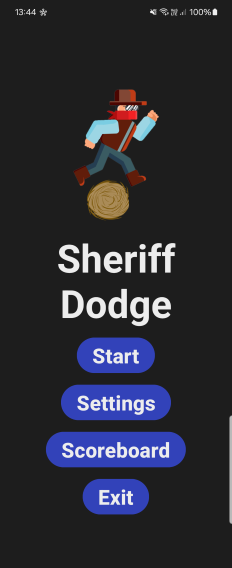
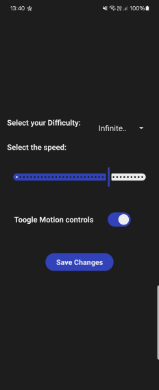

# Sheriff Dodge

A Game made as part of HW at Afeka's `Mobile Apps - 25A10357` Class.

## How to use

1. todo

# Overview

Sheriff Dodge is a game built using `Kotlin 2.1.0`, designed for Android devices.

## App Flow

### 1. Main Menu

 |  
-|-

- **Start Game** - Starts the `game loop`, with the setting selected by the user.
- **Settings** - shows the settings screen.
- **Scoreboard** - shows the scoreboard screen.
- **Exit** - closes the app

### 2. Settings

The settings screen uses the `SettingsManager` to define `global settings` that every other class uses.

`moving objects` - coins, hearts and obstacles
`TiltDetector` - Uses the device's `accelerometer` to identify tilt.

- **Difficulty** - each difficulty settings changes the amount of `moving objects` in each row. Defaults to `Infinitely Easy` which is the easiest difficulty
- **Speed** - changes the tick speed (delay) of the game, Effecting `moving objects`. Defaults to `500`
- **Motion controls** - toggles the motion game controls. Uses `TiltDetector`. Defaults to `off`

### 3. Game

- todo

### 4. Scoreboard

- todo

## Features

- todo

## Authors

- [@lordYorden](https://github.com/lordYorden)

